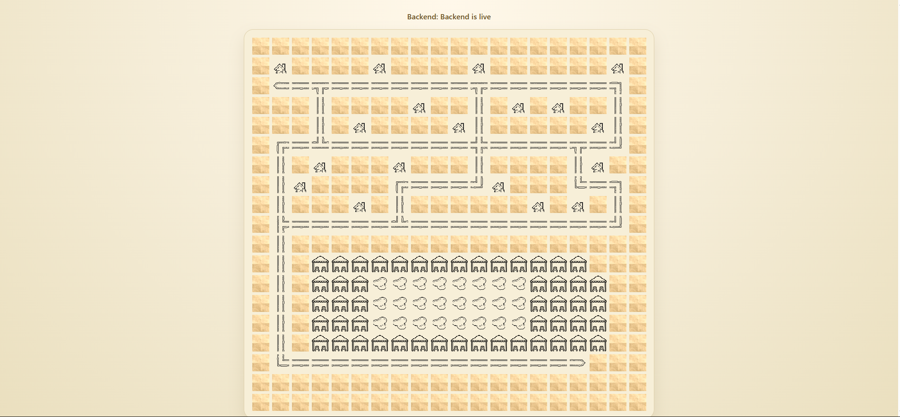

## Resort Booking

A small cabana-booking web app built with an Express backend and a React/Vite frontend. The frontend loads the resort map entirely from the REST API, uses backend-provided cabana state as the source of truth for availability, and lets a guest book a cabana with a one-step popup flow using room number and guest name.

## Features Implemented

- Interactive resort map rendered from API data
- Cabana availability driven by backend cabana state
- Popup booking flow for available cabanas
- Clear unavailable message for already booked cabanas
- Booking confirmation modal after a successful reservation
- Immediate visual update of booked cabanas on the map
- Automated backend and frontend test 

## Core Decisions

I kept the architecture simple: the backend owns guest validation and in-memory booking state, while the frontend stays focused on presentation and user interaction. I chose to return both the ASCII map and structured cabana data from the API so the UI can render the map tiles while treating cabana availability as backend-driven state. The main trade-off is that bookings are intentionally not persisted across backend restarts, because the brief explicitly allows in-memory storage and that keeps the solution straightforward.

## Stack

- Backend: Node.js + Express
- Frontend: React + Vite + TypeScript
- Tests: Node built-in test runner for backend, Vitest + Testing Library for frontend

## Running The App

From the `resort-booking-assessment` directory:

If you want to use custom data: 
```bash
./run.sh --map custom.ascii --bookings custom.json
```

or 
```bash
./run.sh 
```

Both flags are optional. If you don't use any flag it will use the default data.

- `--map` defaults to `backend/map.ascii`
- `--bookings` defaults to `backend/bookings.json`

The single entrypoint starts both services:

- Backend: `http://localhost:3000`
- Frontend: `http://localhost:5173` Vite dev server output is shown in the terminal when it starts.


## Using The App

1. Open the frontend URL shown by Vite.
2. Click a cabana on the map.
3. If it is available, enter room number and guest name in the popup and confirm the booking.
4. If it is already booked, the popup shows that it is unavailable.
5. After a successful booking, the app shows a confirmation modal and the cabana remains visually marked as booked on the map.

## Frontend Rendering Contract

The frontend does not decide cabana availability on its own. It uses the backend `cabanas` response as the authoritative source for:
- which map positions are interactive cabanas
- whether each cabana is booked or available
- which booked style to show on the map
- what booking details to show after a reservation

## API

### `GET /api/health`

Simple health check plus startup counts.

### `GET /api/map`

Returns:
- `ascii`: the resort map layout from the ASCII file
- `cabanas`: structured cabana state with `id`, `row`, `col`, `booked`, and `booking`

### `POST /api/book`

Books a cabana if:
- the cabana exists
- it is not already booked
- the provided room number and guest name match a guest in `bookings.json`

Request body:

```json
{
  "cabanaId": "W1",
  "roomNumber": "101",
  "guestName": "Alice Smith"
}
```

## Tests
First of all let me define what are we even testing? 
Backend:
GET /api/map returns the map plus cabana state.
POST /api/book rejects a room/name that is not in bookings.json.
POST /api/book succeeds for a valid guest and updates in-memory cabana state.
POST /api/book rejects a second attempt to book an already booked cabana.

Frontend:
Clicking an available cabana opens the popup, submits the form, and shows success confirmation.
Clicking a booked cabana shows “not available”.
Invalid guest info shows the rejection popup.
The UI treats API cabana data as the source of truth for interactive cabanas.

Run all tests from the `resort-booking` directory:

```bash
npm test
```

Run backend tests only:

```bash
npm run test --workspace backend
```

Run frontend tests only:

```bash
npm run test --workspace frontend
```

## AI Workflow

I explained my AI workflow exlucively here: (./AI.md).

## Screenshot



